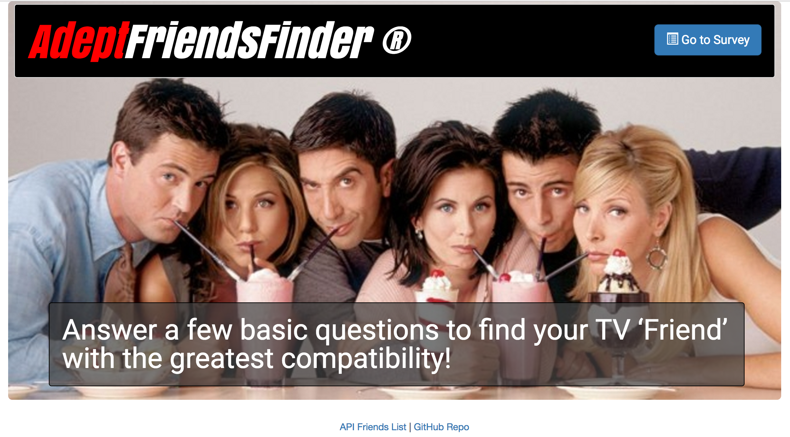
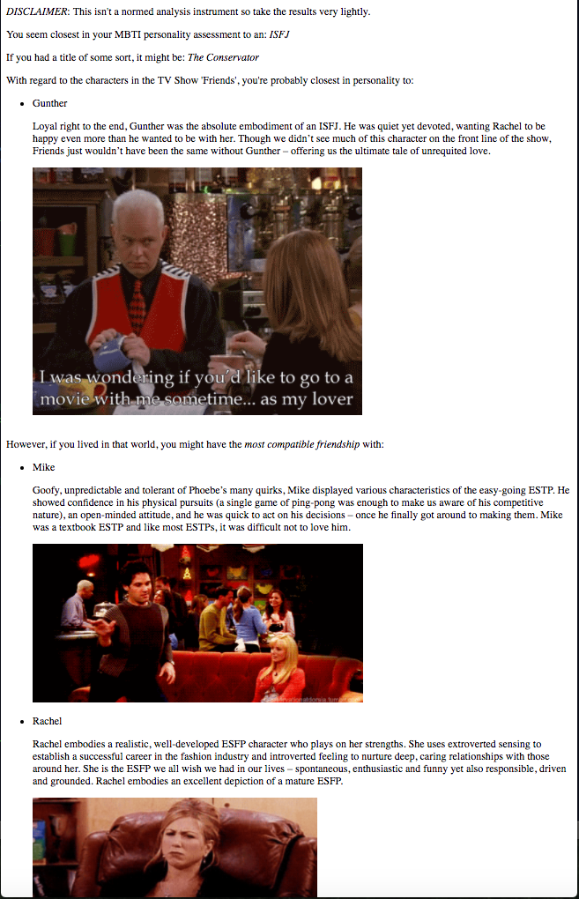
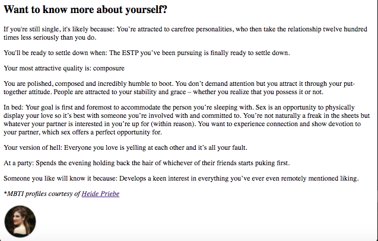

# Adept Friends Finder

This week, we're spoofing a well known social media site.

The goal is to create a (mostly) full stack application that leverages node.js and an express web server to maintain an in-memory database of people and their responses to a Meyers-Briggs personality assessment.  Users respond to the questions to determine their closest match based upon an MBTI compatibility metric.

