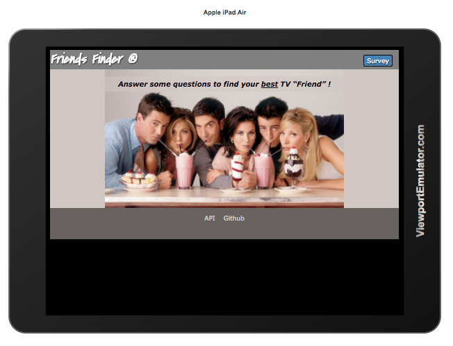
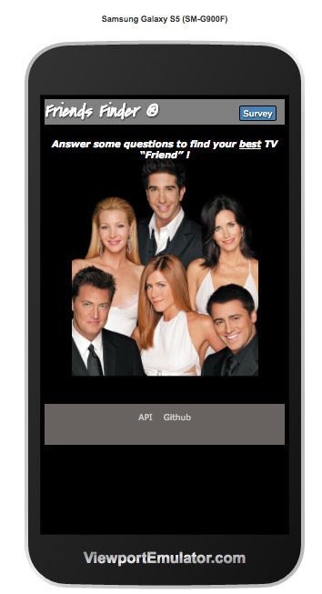
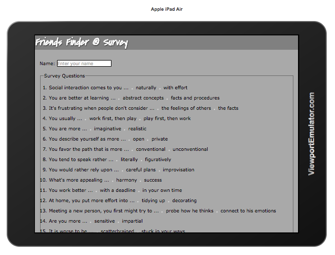
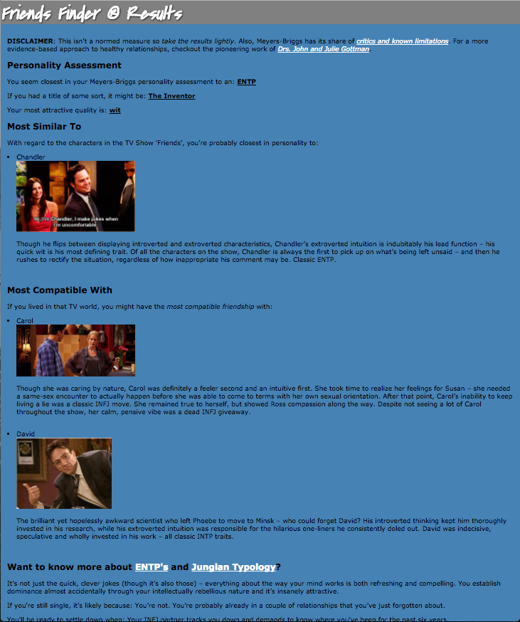
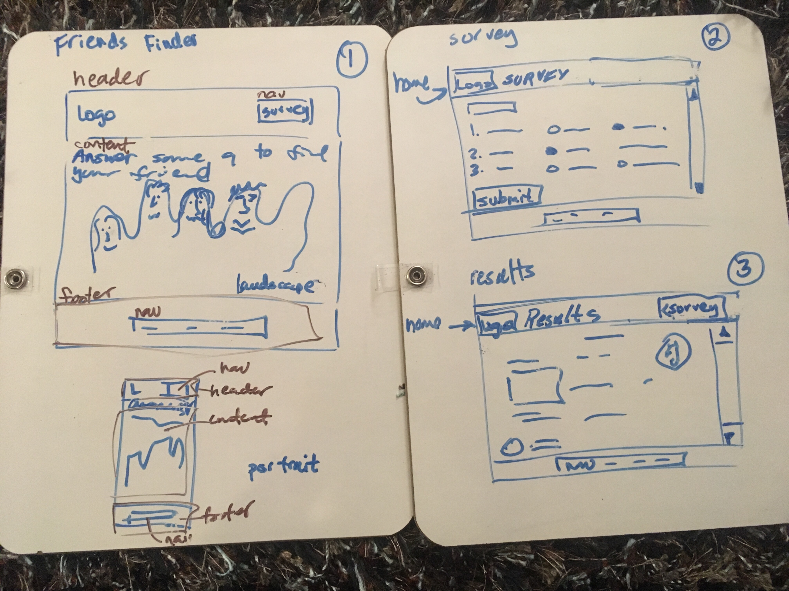

# Friends Finder

This week, I'm mashing up a simplified Meyers-Briggs personality assessment with an MBTI model of the characters from the TV show, Friends.  Users complete a survey to see which character from the show they are most like and with whom they would be most compatible.  It's bogus, but fun.

The goal is to create a (mostly) full stack application that leverages node.js and an express web server to maintain an in-memory database of people and their responses to a Meyers-Briggs personality assessment.  Users respond to the questions to determine their closest match based upon an MBTI compatibility metric.

Some care has been taken to make the interface responsive (mostly).

## Landing page:

## User's complete a survey:

## A typical report looks like this:

# Design

## Scope

The initial problem spec was a simple survey that presumed compatibility based upon how similarly one scored in relation to a pool of other respondents.  It's an interesting premise, but there are many other takes on compatibility that might be more culturally or intellectually interesting to explore (western zodiac, Chinese zodiac, Imago/Family of Origin, Big 5 personality assessment).  In the end, I settled upon a simplified Meyers-Briggs assessment out of expedience and broad adoption despite well known limitations in that measure (i.e., presumes bi-modal distribution whereas personality tends to fall along a normal distribution for certain attributes, significant variance on retesting).  The app is more for entertainment than rigor and I thought the tie-in with the 'Friends' TV (show based upon the engaging character profiles by Heide Priebe) would be fun.

## Approach

Once my brain locked in on MBTI, I built a model that leveraged online profiles and compatibility algorithms to relate an assessment outcome to a subset of TV characters that correlate to a respondents survey results.

This is such a simple application that I realized I didn't need to bother with SPA/AJAX.  Just 3 pages (landing, survey, results).  Didn't need javascript/jQuery.  Initially I had bootstrap in there just so I could get a fancy submit button, until I thought "why?".  I've been meaning to 'get right' with my CSS and pay some dues to the gods of responsive design and bootstrap kinda slathers over that.  My initial attempt at a jumbotron landing page was a sad mish-mash of CSS ignorance until I spent time reading Jon Duckett's HTML & CSS book.  I like what he has to say about liquid design.  I also found Philip Walton's CSS Architecture blog posting very insightful and so I took some kitty steps toward BEM naming conventions.  It's too easy to write crappy CSS and I'd like to adopt approaches that scale.  I especially like PW's insight that pristinely simple HTML often comes at the expense of cruddy CSS and that it's the responsibility of the HTML to specify /how/ some element should be styled through (sometimes non-trivial) class attributes.

I actually wired up a clunky, largely unstyled, unresponsive version of the app and then went back to rethink my front-end design and implementation.  Not that the resulting front-end is any masterpiece.  It's really vanilla.  But it's implemented with semantic HTML5 and the CSS has more quality (in the Robert Pirsig sense) than with my first attempt.

The back-end model came out relatively cleanly and allowed me to wire-up a simple node/express web server in just a few lines of code.  The model is probably my comfort zone,  the eye of the storm where I find my zen before pushing into other areas of an app.

## Next steps

My responsive CSS fu is still very rudimentary.  I was curious to see what I could achieve with just the one 'portrait versus landscape' media query.  I wonder if there's a better way to handle the background image that is sensitive to orientation.  I'd like to pull that out of the CSS somehow and put it back in the HTML as 'content' but I'm not sure how to manage that just yet in a way that doesn't involve a round-trip back to the server.

I'm happy with the model, though I should probably split out the HTML generating functions into templatized files.  I think I'll play with Handlebars next with an eye toward this.  Also, it might be fun to play with the Cheerio screen scraper so more of the model could be built-up in real-time from online content and only rely upon the static model which I manually and laboriously crafted as a fallback.  Still, the source content is relatively static, so the case for this is less compelling beyond the intellectual exercise.

Oh, yeah.  What I /should/ do is start playing with Flexbox.  I think it would give me some needed control over the vertical geometries that otherwise prevent my footer from sticking to the bottom of the window.  It's a recommended standard at this point and clearly worthy of investment.

# Attribution

This application would not be possible without some interesting and compelling work by others who took the time to elaborate and popularize their interest in Meyers-Briggs.

## MBTI assessment survey:

This is probably the weakest link.  I snagged some questions from John Hawksley's simplified assessment website (http://jupiter-34.appspot.com/) and added my own 
rudimentary weightings to the responses.  A true Meyers-Briggs assessment involves many more questions and a trained assessment professional.

## MBTI background videos:

Michael Pierce (https://www.youtube.com/channel/UCmDcT_Pujk8vOcxk_IcnxtQ)

## MBTI compatibility model:

BSM Consulting (http://personalitypage.com/html/partners.html)

## MBTI profile analysis comes from:

Heidi Priebe (http://tcat.tc/1PgB8Af)
