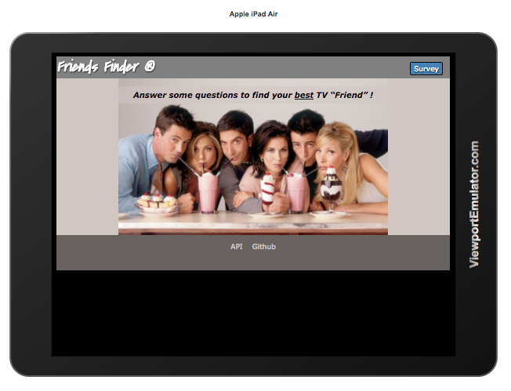
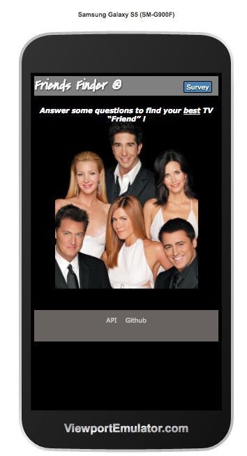
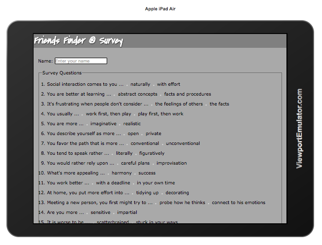
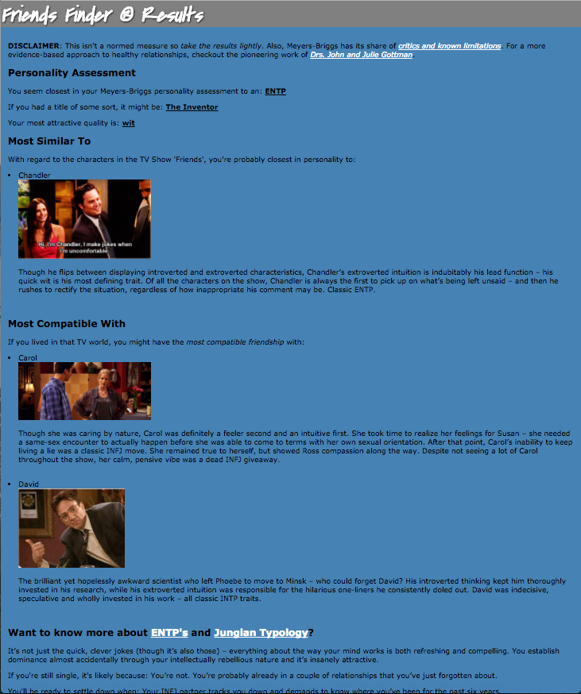

# Friends Finder

This week, I'm mashing up a simplified Meyers-Briggs personality assessment with an MBTI model of the characters from the TV show, Friends.  Users complete a survey to see which character from the show they are most like and with whom they would be most compatible.  It's bogus, but fun.

The goal is to create a (mostly) full stack application that leverages node.js and an express web server to maintain an in-memory database of people and their responses to a Meyers-Briggs personality assessment.  Users respond to the questions to determine their closest match based upon an MBTI compatibility metric.

Some care has been taken to make the interface responsive (mostly).

## Landing page:

## User's complete a survey:

## A typical report looks like this:

# Attribution

## MBTI assessment survey:

This is probably the weakest link.  I snagged some questions from John Hawksley's simplified assessment website (http://jupiter-34.appspot.com/) and added my own 
rudimentary weightings to the responses.  A true Meyers-Briggs assessment involves many more questions and a trained assessment professional.

## MBTI background videos:

Michael Pierce (https://www.youtube.com/channel/UCmDcT_Pujk8vOcxk_IcnxtQ)

## MBTI compatibility model:

BSM Consulting (http://personalitypage.com/html/partners.html)

## MBTI profile analysis comes from:

Heidi Priebe (http://tcat.tc/1PgB8Af)
